# Seahorse 最终完整架构图

更新时间：2026-04-22

## 1. 文档说明

这是一份终局架构图，不代表当前仓库已经全部实现，而是回答：

- Seahorse 最终完成后会由哪些层组成
- 各层之间如何交互
- 写入、召回、遗忘、修复、演化如何形成统一系统

## 2. 最终架构图

```mermaid
flowchart TB
    classDef client fill:#eef6ff,stroke:#2b6cb0,color:#1a365d
    classDef edge fill:#f0fff4,stroke:#2f855a,color:#22543d
    classDef api fill:#fffaf0,stroke:#c05621,color:#7b341e
    classDef pipe fill:#fef5e7,stroke:#d69e2e,color:#744210
    classDef core fill:#faf5ff,stroke:#6b46c1,color:#44337a
    classDef store fill:#edf2f7,stroke:#4a5568,color:#1a202c
    classDef ops fill:#fff5f5,stroke:#c53030,color:#742a2a

    subgraph Clients["使用方 / 生态接入层"]
        Agent["AI Agents"]
        App["Applications"]
        MCPClient["MCP Clients"]
        SDK["Python / Node / WASM SDK"]
    end

    subgraph Edge["协议与接入层"]
        HTTP["REST / HTTP API"]
        CLI["CLI"]
        MCP["MCP Server"]
        Auth["Auth / Namespace / Policy"]
    end

    subgraph Orchestration["编排与运行时层"]
        Engine["Engine"]
        Ingest["Ingest Pipeline"]
        Recall["Recall Pipeline"]
        Forget["Forget Pipeline"]
        Dream["Dream Pipeline"]
        Rebuild["Rebuild / Compact Pipeline"]
    end

    subgraph Cognitive["认知内核层"]
        Thalamus["Thalamus\nQuery analysis\nFocus / Entropy / Worldview / Gate"]
        Cortex["Cortex\nVector Index\nHNSW / Archive / mmap / rkyv"]
        Synapse["Synapse\nConnectome\nSpike propagation / Association"]
        Tide["Weak Signal / Tide\nResidual route / Gravity field"]
        Fusion["Fusion / Ranking\nDedup / Rerank / Explainability"]
        Embedding["Embedding Provider\nEmbed / Re-embed / Cache fill"]
        Tagging["Tagging / Normalization\nTag extract / Alias / Centroid"]
    end

    subgraph Storage["事实存储与归档层"]
        SQLite["SQLite Fact Store\nfiles / chunks / tags / chunk_tags\nretrieval_log / repair_queue / embedding_cache"]
        Connectome["Connectome Store\nTag co-occurrence / topology"]
        Archive["Archive Store\nIndex snapshot / versioned archive"]
        Blob["Optional Blob / File Store\nraw file / attachment / cold archive"]
    end

    subgraph Async["后台维护与演化层"]
        Cerebellum["Cerebellum Scheduler"]
        Repair["Repair Workers"]
        Health["Health Analyzer"]
        Compaction["Compaction / Prune"]
        DreamJob["Dream / Memory Consolidation"]
        Recovery["Startup Recovery"]
    end

    subgraph Observe["可观测与控制层"]
        Metrics["Metrics / Telemetry"]
        Logs["Structured Logs / Audit Trail"]
        Config["Config / Feature Gates"]
        Admin["Admin Controls / Rebuild Triggers"]
    end

    Agent --> HTTP
    Agent --> MCP
    App --> HTTP
    MCPClient --> MCP
    SDK --> HTTP
    SDK --> CLI

    HTTP --> Auth
    CLI --> Auth
    MCP --> Auth

    Auth --> Engine
    Engine --> Ingest
    Engine --> Recall
    Engine --> Forget
    Engine --> Dream
    Engine --> Rebuild

    Ingest --> Embedding
    Ingest --> Tagging
    Ingest --> SQLite
    Ingest --> Cortex
    Ingest --> Synapse
    Ingest --> Archive
    Ingest --> Logs

    Recall --> Embedding
    Recall --> Thalamus
    Thalamus --> Cortex
    Thalamus --> Tide
    Thalamus --> Synapse
    Cortex --> Fusion
    Tide --> Fusion
    Synapse --> Fusion
    Fusion --> Recall
    Recall --> SQLite
    Recall --> Logs
    Recall --> Metrics

    Forget --> SQLite
    Forget --> Cortex
    Forget --> Synapse
    Forget --> Repair
    Forget --> Logs

    Dream --> DreamJob
    Dream --> Logs

    Rebuild --> Repair
    Rebuild --> Cortex
    Rebuild --> Synapse
    Rebuild --> Archive
    Rebuild --> SQLite
    Rebuild --> Logs

    Tagging --> SQLite
    Tagging --> Connectome
    Embedding --> SQLite
    Cortex --> Archive
    Cortex --> SQLite
    Synapse --> Connectome
    Synapse --> SQLite
    SQLite --> Blob

    Cerebellum --> Repair
    Cerebellum --> Health
    Cerebellum --> Compaction
    Cerebellum --> DreamJob
    Cerebellum --> Recovery

    Repair --> SQLite
    Repair --> Cortex
    Repair --> Synapse
    Repair --> Archive
    Health --> Metrics
    Health --> Logs
    Compaction --> SQLite
    Compaction --> Archive
    DreamJob --> Synapse
    DreamJob --> SQLite
    Recovery --> Archive
    Recovery --> SQLite
    Recovery --> Cortex
    Recovery --> Synapse

    Config --> Engine
    Config --> Cerebellum
    Admin --> Rebuild
    Admin --> Cerebellum
    Logs --> SQLite

    class Agent,App,MCPClient,SDK client
    class HTTP,CLI,MCP,Auth edge
    class Engine,Ingest,Recall,Forget,Dream,Rebuild pipe
    class Thalamus,Cortex,Synapse,Tide,Fusion,Embedding,Tagging core
    class SQLite,Connectome,Archive,Blob store
    class Cerebellum,Repair,Health,Compaction,DreamJob,Recovery,Metrics,Logs,Config,Admin ops
```

## 3. 图的阅读方式

从上到下可以把这张图理解为五层。

### 3.1 接入层

最上层是 Agent、应用、MCP 客户端和多语言 SDK。  
这一层不直接碰存储，也不直接碰认知算法，只通过统一入口访问系统。

### 3.2 协议与运行时层

这一层负责把外部请求转成标准能力调用：

- `REST / HTTP`
- `CLI`
- `MCP`
- `Auth / Namespace / Policy`
- `Engine + Pipelines`

Seahorse 最终必须把 ingest、recall、forget、dream、rebuild 都收敛为显式 pipeline，而不是散落的脚本式逻辑。

### 3.3 认知内核层

这是 Seahorse 与普通 RAG 最大的差异层：

- `Thalamus` 负责 query 分析、focus、entropy、worldview、路由与 gate
- `Cortex` 负责向量检索、索引结构、archive 持久化恢复
- `Synapse` 负责 connectome、联想扩散、spike association
- `Tide / Weak Signal` 负责残差信号与弱信号召回
- `Fusion / Ranking` 负责多来源结果去重、融合、解释

这一层完成的不是单纯搜索，而是一整次“认知型想起”。

### 3.4 存储与归档层

这层是系统的事实底座：

- `SQLite` 保存事务事实源
- `Connectome` 保存 tag 拓扑
- `Archive` 保存索引快照与版本化归档
- `Blob Store` 保存大文件、原始附件或冷存储对象

这也是为什么 Seahorse 的最终形态不是“SQLite 单体包打一切”，而是：

- `SQLite` 存事实
- `Archive` 存索引快照
- `Connectome` 存联想拓扑
- 认知模块在其上进行编排与计算

### 3.5 后台维护与可观测层

这层保证系统长期可运行：

- `Cerebellum` 调度后台任务
- `Repair` 做修复
- `Health Analyzer` 做漂移与损坏检测
- `Compaction` 做压缩和清理
- `Dream` 做离线整合
- `Recovery` 做启动恢复

旁路上的 `Metrics / Logs / Config / Admin` 负责让整个系统可审计、可调优、可恢复。

## 4. 最终主链路

### 4.1 写入链路

`Ingest Pipeline` 最终会执行：

1. 输入接收与预处理
2. Embedding 生成或缓存命中
3. Tag 提取与规范化
4. SQLite 事务写入
5. Cortex 索引更新
6. Synapse connectome 更新
7. Archive 刷新
8. 审计日志与失败修复任务登记

### 4.2 召回链路

`Recall Pipeline` 最终会执行：

1. Query embedding
2. `Thalamus` 产出 focus / entropy / worldview / gate
3. `Cortex` 执行主向量召回
4. `Tide` 补充 weak signal
5. `Synapse` 补充 spike association
6. `Fusion` 做统一去重、重排和解释
7. 写入 `retrieval_log` 与 telemetry

### 4.3 遗忘与演化链路

`Forget / Dream / Rebuild` 最终共同组成记忆生命周期管理：

- `Forget` 负责删除、衰减、标记与 repair 触发
- `Dream` 负责后台联想整合与长期结构演化
- `Rebuild / Compact` 负责索引重建、拓扑重组和 archive 刷新

## 5. 最关键的终局判断

如果 Seahorse 最后只有：

- `HTTP + SQLite + 向量搜索`

那它只是一个检索服务。

只有当它真正具备：

- 认知内核
- 多来源召回
- 联想拓扑
- 修复与恢复
- 记忆生命周期管理
- 可观测与可演化能力

它才算完成 `README` 和最终愿景文档所定义的目标。

## 6. 结论

Seahorse 最终完成后的完整形态，是一个面向 AI Agent 的多层认知记忆系统：

- 上层对外暴露统一协议
- 中层以 pipeline 编排完整记忆生命周期
- 核心层以 `Thalamus + Cortex + Synapse + Tide + Fusion` 完成认知召回
- 底层以 `SQLite + Connectome + Archive` 提供事实、拓扑和归档底座
- 后台以 `Cerebellum` 驱动修复、恢复、压缩与 dream 演化

它的最终目标，不是更快地“找到相似文本”，而是让 Agent 拥有一个可长期存在、可解释、可修复、可演化的记忆系统。
